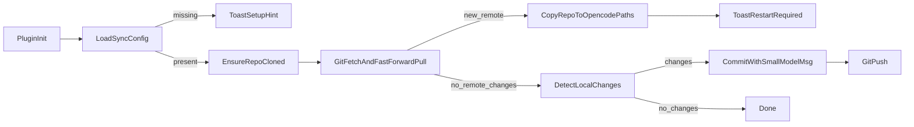

# OpenCode Config Sync (GitHub)

## Goals

- Sync **global** OpenCode configuration across machines (not project `.opencode`).
- Default to **non-sensitive** config-only sync.
- Allow opt-in syncing of **secrets** (OpenCode auth tokens / key files), but **only** when the GitHub repo is **private**.
- On OpenCode startup: **pull remote**, apply changes, and **toast** “restart to apply”.
- Use the user’s configured **`small_model`** to generate concise commit messages (fallback to deterministic message if model unavailable).
- Allow **per-machine overrides** so some settings differ across environments.

## Repo + security model

- **Transport/auth**: use **GitHub CLI (`gh`)** (your choice) for:
- `gh auth status` / `gh repo view` / `gh repo create` (optional) / `gh repo clone`.
- Git operations via `git` (with auth handled by `gh`).
- **Hard rule**: if `includeSecrets=true`, plugin verifies repo is private (via `gh repo view --json isPrivate`). If not private or not verifiable → refuse + toast.

## What gets synced

### Default (safe)

- `~/.config/opencode/opencode.json` (and `opencode.jsonc` if present)
- `~/.config/opencode/AGENTS.md`
- Directories under `~/.config/opencode/`:
- `agent/`, `command/`, `mode/`, `tool/`, `themes/`, `plugin/`

### Optional (requires private repo)

- `~/.local/share/opencode/auth.json` (provider API keys / OAuth tokens)
- `~/.local/share/opencode/mcp-auth.json` (MCP OAuth tokens)
- “Private key files” support as **explicit extra paths** (user-configurable allowlist), because OpenCode itself encourages `{file:...}` references and these can point anywhere.

## Per-machine overrides

- Create a local-only overrides file, **not committed**, e.g. `~/.config/opencode/opencode-sync.overrides.jsonc`.
- Plugin applies overrides in two places:
- **Runtime**: via the plugin `config(config)` hook, deep-merge overrides into the in-memory config.
- **On apply**: after copying pulled files into `~/.config/opencode`, re-apply overrides to `opencode.json(c)` so a restart uses the local values.

## Startup flow (auto-apply)

Behavior details:

- Prefer **fast-forward pulls**. If the local repo has diverged (conflict/rebase needed), toast an error and provide a guided recovery command.
- When remote updates are applied, toast:
- title: `opencode-sync`
- message: `Config updated. Restart OpenCode to apply.`
- Commit messages:
- gather `git diff --name-status` / `--stat`
- ask `small_model` to output a single-line message (max ~72 chars)
- fallback: `Sync OpenCode config (${YYYY-MM-DD})`

## Plugin UX (commands/tools)

Implement a custom tool `opencode_sync` (plugin-defined) with subcommands:

- `status` (last sync, repo, branch, pending changes)
- `init` (configure repo: owner/name/url; optionally create repo as private)
- `pull` (manual pull+apply)
- `push` (manual commit+push)
- `enable-secrets` (flip includeSecrets and enforce private)

Provide slash commands (loaded from markdown, injected via `config.command`) that call the tool.

## Implementation structure (new package)

Base on the included template. Primary files:

- Create new plugin package directory (e.g. `opencode-sync/`) from [`/Users/ihildy/Documents/Personal/opencode-sync/opencode-plugin-template/template`](file:///Users/ihildy/Documents/Personal/opencode-sync/opencode-plugin-template/template)
- Main plugin entry: [`opencode-sync/src/index.ts`](opencode-sync/src/index.ts)
- Add modules:
- `src/sync/paths.ts` (resolve XDG paths, file lists)
- `src/sync/repo.ts` (gh+git operations)
- `src/sync/apply.ts` (copy files, permissions)
- `src/sync/commit.ts` (small_model message generation via `ctx.client`)
- `src/sync/config.ts` (plugin config + overrides parsing)
- `src/sync/errors.ts`
- Add command markdowns under `src/command/` (e.g. `opencode-sync-init.md`, `opencode-sync-status.md`, …).

## Testing

- Unit tests (vitest) for:
- path resolution on macOS/Linux/Windows (pure functions)
- include/exclude selection
- overrides deep-merge behavior
- repo visibility enforcement logic (mocked)

## Deliverables

- Working npm-publishable plugin.
- README with:
- install: `npm install -g <pkg>`
- enable: add to global config `"plugin": ["<pkg>"]`
- `gh auth login` requirement
